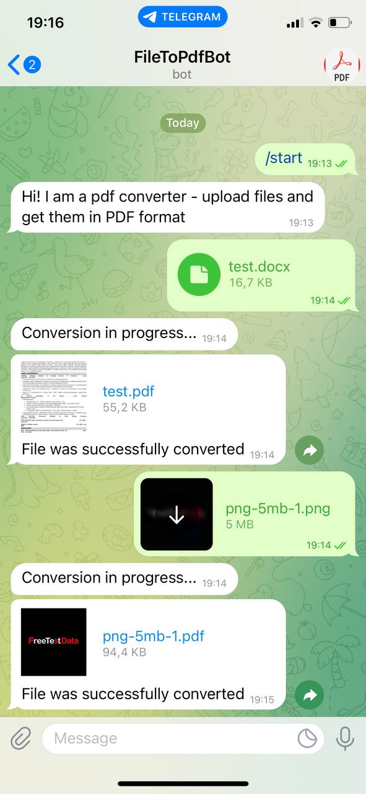

# PDF Converter Bot

## Telegram ID - [@fileToPdfBot](https://t.me/fileToPdfBot)

This bot will convert one or several files into PDF format. Based on `unoconv` command [[Link]](https://linux.die.net/man/1/unoconv), which converts any document from and to any LibreOffice supported format. 

Bot supports conversion from MS Office Documents, images, HTML, txt and many others formats.

Built with [Telebot](https://pkg.go.dev/gopkg.in/tucnak/telebot.v2#section-readme). Deployed on [Google Cloud Run](https://cloud.google.com/run) via Docker container.

## Example

